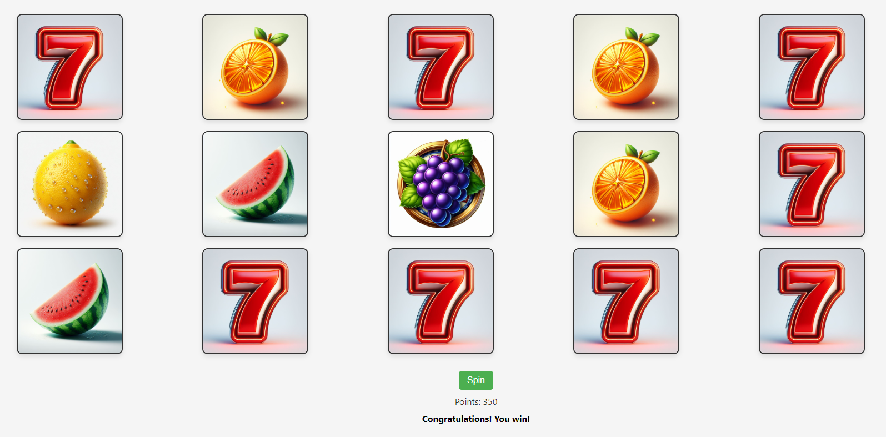

# SpinWin-Slots

A simple slot machine game built with HTML, CSS, and JavaScript, where players can spin to win points by aligning symbols across various rows.

## Overview

The SpinWin-Slots offers an interactive gaming experience with the following features:

- **Spin Button:** Allows players to initiate a spin and test their luck.
- **Points Display:** Keeps track of the player's current points balance.
- **Result Message:** Provides instant feedback on wins or losses after each spin.

## How to Play

1. Click the "Spin" button to start the game.
2. Watch as the slot machine spins and reveals the symbols.
3. Win points by aligning symbols across specific rows according to predefined win conditions.
4. Keep spinning to accumulate points and see if luck is on your side!

## Features

- **Dynamic Slot Display:** Utilizes JavaScript to dynamically generate and display slot symbols upon spinning.
- **Win Detection:** Implements win detection logic to determine winning combinations and award points accordingly.
- **Points Management:** Tracks the player's points balance and updates it based on wins or losses.

## Symbols

The slot machine features the following symbols (images are generated from DALL-E):
- Seven 7️⃣
- Orange 🍊
- Cherry 🍒
- Grapes 🍇
- Watermelon 🍉
- Lucky 🍀
- Lemon 🍋

## Win Conditions

The game evaluates various row combinations to determine wins. Winning combinations result in point increments, while losses are indicated through the result message.

## Points System

Players start with an initial balance of 1000 points and can win or lose points based on their spin outcomes.

## Limitations

- This is a basic implementation for demonstration purposes and may lack advanced features found in commercial slot machine games.
- Points accumulation and win conditions are simplified for ease of understanding and gameplay.

## Preview

 
<!-- Connect with me -->
<h2 align="center">Contact Me</h2>
<!--icons and links-->

  <a href="https://www.linkedin.com/in/mateo1mc/" target="blank">
Feel free to connect with me and explore more!
</a>

<br
